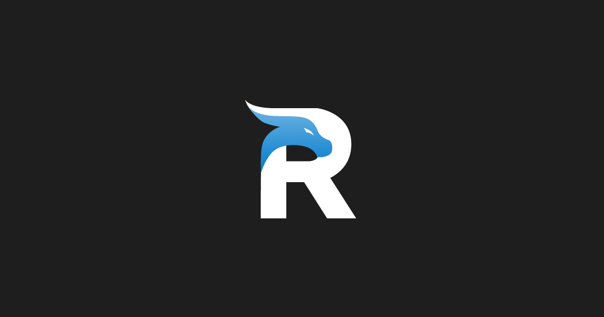
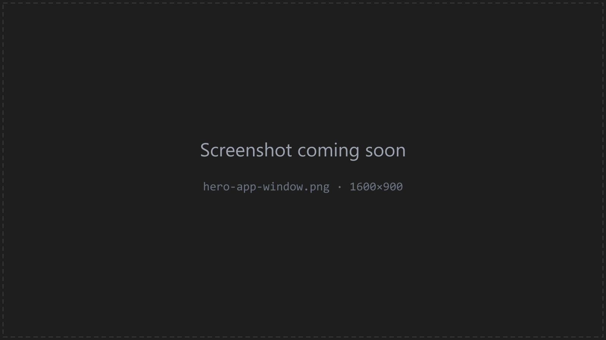

  

<h1 align="center">
  
  Retro Asset Studio - Feedback
</h1>

  <strong>Bug reports, feature ideas and questions for <a href="https://retroassetstudio.com">Retro Asset Studio</a></strong> 
  the free Windows app that turns a text prompt into clean 16-bit pixel art: characters, backgrounds, props and animated spritesheets.

  
  
  
  

---

> **This repository contains no source code.** Retro Asset Studio is closed-source freeware by
> [GameRoad Studio](https://retroassetstudio.com). This is the public place to report bugs, propose
> features and ask questions during the Alpha.

  

## Where to post what

| I want to… | Go to |
|---|---|
| Report something that is broken | [**Open a bug report**](https://github.com/gameroadstudio/retro-asset-studio-feedback/issues/new?template=bug_report.yml) |
| Suggest a feature or an improvement | [**Open a feature request**](https://github.com/gameroadstudio/retro-asset-studio-feedback/issues/new?template=feature_request.yml) |
| Ask a question, share what you made, discuss ideas | [**Discussions**](https://github.com/gameroadstudio/retro-asset-studio-feedback/discussions) |
| Something private (security, account, licensing) | **support@retroassetstudio.com** |

Before opening an issue, please search the [existing issues](https://github.com/gameroadstudio/retro-asset-studio-feedback/issues?q=is%3Aissue)
and check the [Troubleshooting](https://retroassetstudio.com/docs/troubleshooting/) and
[FAQ](https://retroassetstudio.com/docs/faq/) pages - many Alpha limitations are already listed in
[Alpha status](https://retroassetstudio.com/docs/alpha-status/).

## What makes a good bug report

The bug report template asks for these; having them up front makes fixes much faster:

1. **App version** - `Help → About Retro Asset Studio` (e.g. `0.1.0-alpha.1`).
2. **Windows version** - `Settings → System → About` (e.g. Windows 11 23H2).
3. **AI provider and model** - from `Project Settings → API Configuration` (e.g. Google Gemini, `gemini-3-pro-image-preview`).
4. **Steps to reproduce** - what you clicked, in order.
5. **What happened vs. what you expected.**
6. **The error message** - errors appear in the status bar at the bottom of the app; use its copy button and paste the text.
7. **Screenshots** of the screen where it went wrong.

Please **never attach `app.json`** from your data folder: it contains your (encrypted) API keys.
Exported `.rasproj` project archives are safe to share - they never include keys - but only attach
them if you are fine with the images inside being public.

## Alpha status

Retro Asset Studio is in **public Alpha**:

- Windows 10/11 x64 only; macOS and Linux are planned.
- The installer is not code-signed yet, so Windows SmartScreen shows a warning
  (see [Installation](https://retroassetstudio.com/docs/installation/#windows-smartscreen-warning)).
- Google Gemini is the enabled AI provider; Hugging Face and OpenAI are visible but disabled for now.
- Back up your projects with `File → Export Project…` before updating.

The roadmap and known limitations live in the docs:
[Alpha status & known limitations](https://retroassetstudio.com/docs/alpha-status/) ·
[Changelog](https://retroassetstudio.com/docs/changelog/).

## Support the project

The app is free and has no paid tier. If it saves you time, you can
[buy the developer a coffee on Ko-fi](https://ko-fi.com/gameroadstudio) - donations fund the
code-signing certificate, macOS/Linux builds and new features.

---

  © 2026 GameRoad Studio | <a href="https://retroassetstudio.com/terms.html">EULA</a> | <a href="https://retroassetstudio.com/privacy.html">Privacy</a> | <a href="https://retroassetstudio.com">retroassetstudio.com</a>

